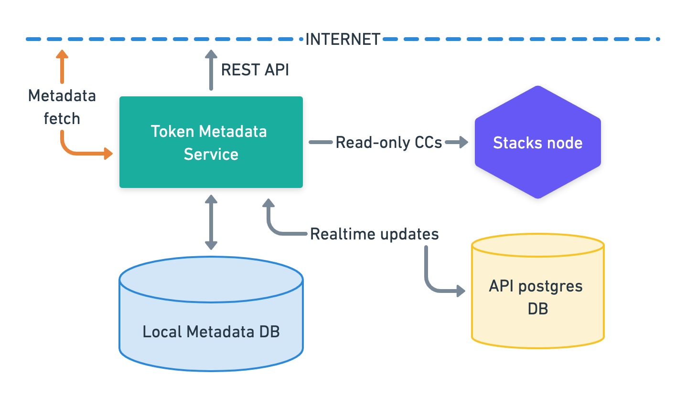
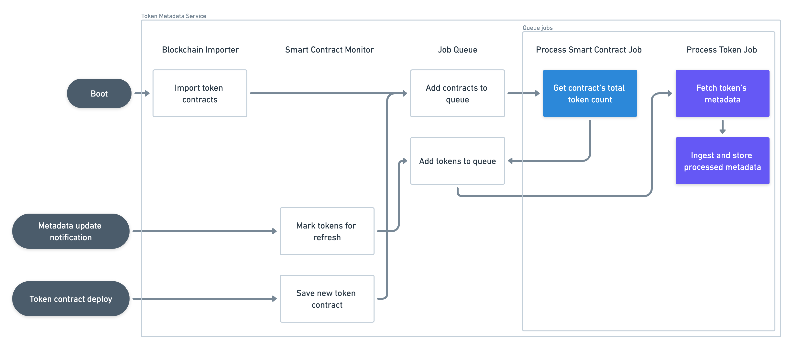

### Service architecture

This section gives you an overview of external and internal architectural diagrams.

### External architecture

The external architectural diagram shows how the Token metadata API is connected to three systems: Stacks node, Stacks blockchain API database, and Postgres database.

1. Token metadata API interacts with the Stacks Blockchain API database( referred to as Local Metadata DB in the diagram) to import all historical smart contracts when booting up and to listen for new contracts that may be deployed. Read-only access is recommended as this service will never need to write anything to this database(DB).
2. A Stacks node to respond to all read-only contract calls required when fetching token metadata (calls to get token count, token metadata URIs, etc.).
3. A local Postgres DB to store all processed metadata info.

The service needs to fetch external metadata files (JSONs, images) from the internet, so it must have access to external networks.

### Internal architecture

The following is the internal architectural diagram of the Token metadata API.

